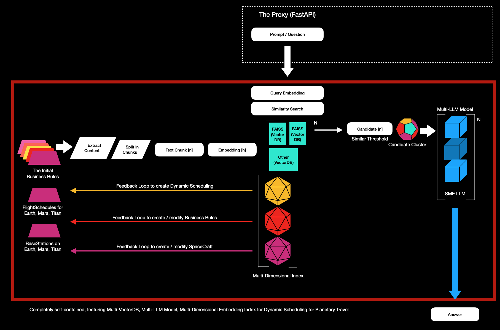

# POC: Harnessing the Power of VectorDB for Dynamic Scheduling: Earth, Mars and Titan 

- Dare to Dream
- Inspire Bold Leadership
- Embrace Diversity in Thought and Innovation
- Explore together & unlock interplanetary knowledge

------------------------------

Fully self-contained, integrating Multi-VectorDB, Multi-LLM Model, and Multi-Dimensional Embedding Index for Dynamic Scheduling for Interplanetary Travel in the year 2035, utilizing VectorDB, FAISS, and Multi-LLM Models. By harnessing multi-dimensional embedding and real-time vector management, the system ensures efficient decision-making and resource allocation, optimizing complex Interplanetary missions and travel.

------------------------------

